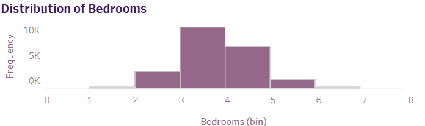

# King County House Sales Dashboard

## 1. Background and Overview
The housing market is an essential component of the economy, and understanding the dynamics of house sales can provide valuable insights for buyers, sellers, and real estate professionals. This project focuses on analyzing house sales data from King County to visualize key trends and distributions in the housing market.

Using Tableau, an interactive dashboard has been created to visualize house sales, offering insights into various metrics, including average sales prices and distribution of house characteristics. This analysis aims to equip stakeholders with data-driven insights for informed decision-making in the real estate market.

The dataset consists of various variables, making it a rich source for understanding the factors that influence house sales. The data covers house sales from **1st May 2014 to 2015**.

## 2. Data Structure Overview
The dataset utilized in this analysis includes the following key variables:

- **Sale Price**: The price at which the house was sold.
- **Date of Sale**: The date when the house was sold.
- **Year Built**: The year the house was constructed.
- **Square Feet Living**: The living area of the house in square feet.
- **Square Feet Lot**: The lot area of the house in square feet.
- **Bedrooms**: The number of bedrooms in the house.
- **Bathrooms**: The number of bathrooms in the house.

This data is visualized through multiple filters, allowing users to explore the dataset based on month, day, year built, square feet living, and square feet lot.

## 3. Executive Summary
This project presents a comprehensive analysis of house sales in King County. The dashboard allows users to filter insights based on multiple parameters, including time, property characteristics, and location. Key highlights from the analysis include:

### Major Visualizations:

- **Daily Average House Sales Price**: A line graph showing the average house sales price over time, revealing trends and fluctuations in the market.
- **Distribution of House Prices**: A histogram illustrating how house prices are distributed, providing insights into pricing ranges.
- **Distribution of Bedrooms and Bathrooms**: Bar charts showing the distribution of the number of bedrooms and bathrooms, helping identify common house configurations.
- **Sales Map**: A map visualization displaying house sales locations, allowing users to see geographical trends in sales.
- **Views vs Condition Heatmap**: A heatmap showing the relationship between views and the condition of houses, offering insights into buyer preferences.

## 4. Insights Deep Dive
1. **Average House Sales Price**  
   The average house sales price is around **$500,000**. The highest recorded sale was **$1,000,000** on **30/11/2014**, while the lowest sale price was **$219,000** on **15/02/2015**. The last record shows a house price of **$1,310,000** on **27/05/2015**.  
   

2. **Distribution of House Prices**  
   The distribution of house prices reveals that more buyers are attracted to houses priced between **$200,000 and $500,000**.  
   

3. **Bedrooms Preference**  
   Houses with **3 bedrooms** are the most preferred, followed closely by houses with **4 bedrooms**.  
   

4. **Bathrooms Requirement**  
   Most houses feature at least **2 bathrooms**, indicating a preference for properties with multiple bathrooms.  
   

5. **Geographic Sales Distribution**  
   The map visualization shows that the highest total sales are generated from the ZIP code **98022**, indicating a strong market presence in that area.  
   

## 5. Recommendations
Based on the insights derived from the analysis, the following recommendations are provided for stakeholders in the King County housing market:

- **Pricing Strategies**: Utilize insights from the average sales price trends to adjust pricing strategies based on seasonal fluctuations.
- **Market Positioning**: Focus on the most common property configurations (bedrooms and bathrooms) to tailor offerings to buyer preferences.
- **Geographic Focus**: Pay attention to high-sales areas when marketing properties or exploring investment opportunities.
- **Property Condition Improvements**: Consider improvements in properties that may be in poor condition but have a high number of views to enhance marketability.

## Conclusion
The King County House Sales Dashboard project provides a detailed look into the housing market dynamics in King County. By analyzing house sales data across various dimensions, this report highlights key areas for market understanding and decision-making. The insights gained from this project offer actionable recommendations for buyers, sellers, and real estate professionals.

## Visualizations and Filters
- **Filters**: Five filters for analyzing metrics based on month, day, year built, square feet living, and square feet lot.
- **Key Visuals**: Average house sales prices, distribution of house prices, bedrooms, bathrooms, geographical sales data, and heatmaps visualized through various Tableau components.

## Tableau Public Link
You can view the interactive visualization on Tableau Public: [King County House Sales Dashboard](https://public.tableau.com/shared/NDW43XK3X?:display_count=n&:origin=viz_share_link)
